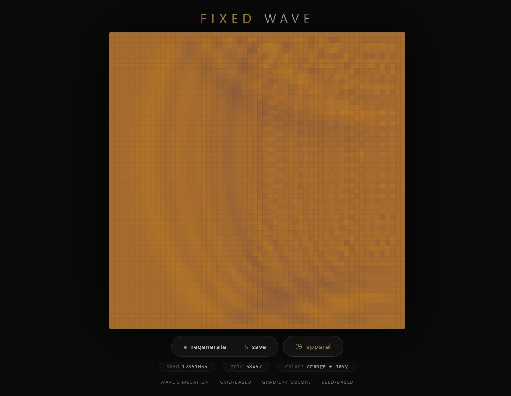
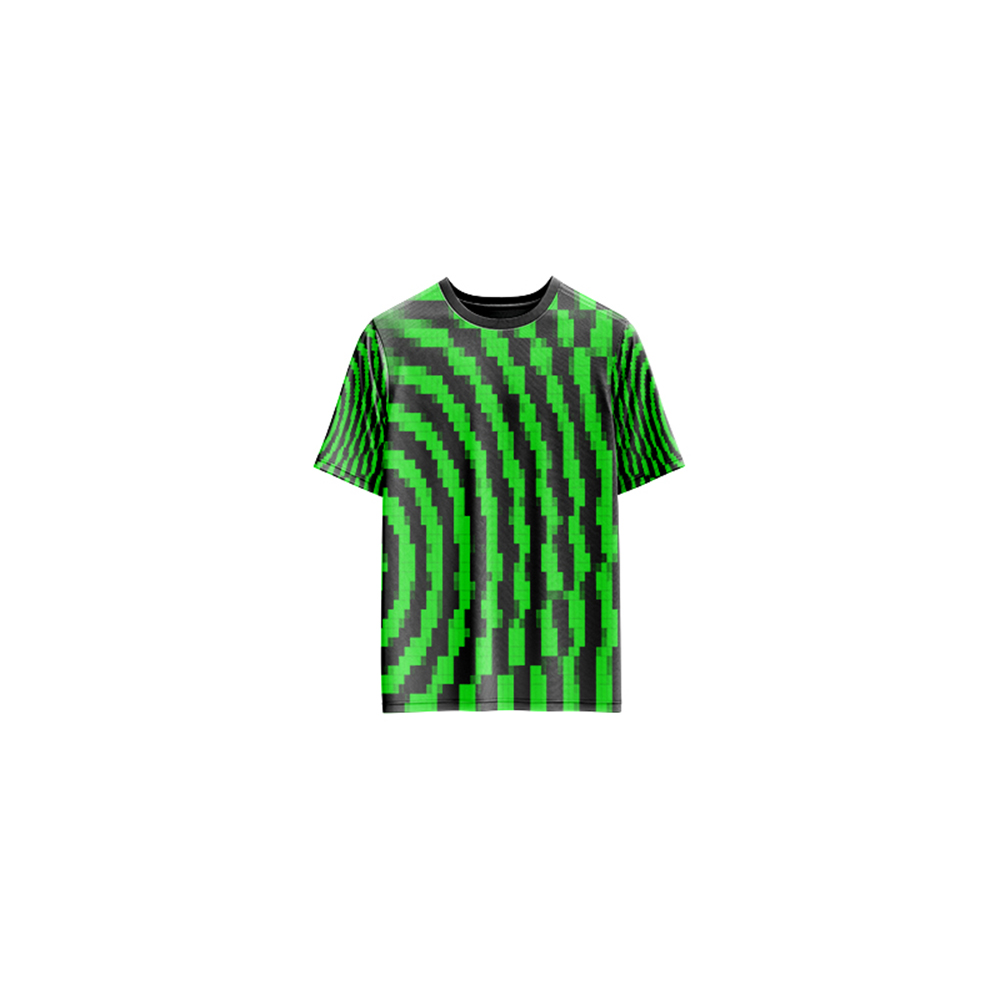

# Fixed Wave — Generative Art

[](https://reyrove.github.io/Fixed-Wave-Generative-Art)
[](https://opensource.org/licenses/MIT)

> **Generative wave simulation art.** Each refresh creates a unique wave propagation simulation on a grid, with beautiful gradient colors and organic wave patterns.

## 🎨 Live Demo

<div align="center">
  <a href="https://reyrove.github.io/Fixed-Wave-Generative-Art" target="_blank">
    
  </a>
  <br><br>
  <a href="https://reyrove.github.io/Fixed-Wave-Generative-Art" target="_blank">
    
  </a>
  <br>
  <em>Click the image or button to experience the generative art</em>
</div>

## 👕 Apparel Preview

<div align="center">
  
  <br>
  <em>Fixed Wave artwork printed on a T-shirt</em>
</div>

## ✨ Features

- **Wave Simulation** — Realistic wave propagation using finite difference method
- **Grid-Based** — 10-160 cells in a dynamic grid
- **Gradient Colors** — Beautiful color transitions between two random colors
- **Oscillating Source** — Single point creates continuous waves
- **Fixed Boundaries** — Waves reflect off the edges
- **Animated Motion** — Continuous, flowing wave animation
- **Rich Color Palettes** — 16 predefined colors with random combinations
- **Seed-Based** — Every composition is unique and reproducible via its seed
- **Save & Share** — Download as PNG with seed in filename
- **Apparel Mode** — Preview artwork on a T-shirt mockup
- **Responsive** — Works on desktop, tablet, and mobile
- **Pure JavaScript** — No external dependencies
- **Keyboard Shortcuts**:
  - `R` — Regenerate
  - `S` — Save image
  - `T` — Toggle apparel view

## 🎨 Artwork Details

| Parameter | Range | Description |
|-----------|-------|-------------|
| **Grid Columns** | 10–160 | Horizontal resolution |
| **Grid Rows** | 10–160 | Vertical resolution |
| **Colors** | 16 options | Random color combinations |
| **Wave Speed** | Variable | Random propagation speed |
| **Source Frequency** | 10–310 Hz | Oscillation frequency |

## 🌊 The Physics

### Wave Equation
The artwork simulates the 2D wave equation using a finite difference method:

```
∂²u/∂t² = c²(∂²u/∂x² + ∂²u/∂y²)
```

### Fixed Boundaries
All edges of the grid are fixed at zero displacement, creating reflections and complex interference patterns.

### Oscillating Source
A single point in the grid oscillates continuously, generating waves that propagate outward and reflect off the boundaries.

## 🚀 Quick Start

### Local Development

```bash
# Clone the repository
git clone https://github.com/reyrove/Fixed-Wave-Generative-Art.git

# Navigate to the directory
cd Fixed-Wave-Generative-Art

# Open in browser
open index.html
# or use a live server
```

### Deploy to GitHub Pages

1. Push to GitHub
2. Go to Settings → Pages
3. Select branch `main` and root folder
4. Your site will be live at `https://reyrove.github.io/Fixed-Wave-Generative-Art`

## 🧠 How It Works

The artwork is generated using a deterministic random number generator, seeded by timestamp + random noise. Every refresh:

1. **Setup**:
   - Random grid size (10-160 columns, rows)
   - Random two colors from 16-color palette
   - Random wave speed and source frequency
   - Random source position

2. **Wave Simulation**:
   - Uses finite difference method to solve wave equation
   - Fixed boundaries (zero displacement at edges)
   - Oscillating source generates continuous waves
   - Waves propagate and reflect naturally

3. **Rendering**:
   - Each cell colored based on wave height
   - Gradient between two random colors
   - Alpha varies with wave height for depth
   - Smooth, flowing animation

## 📁 File Structure

```
Fixed-Wave-Generative-Art/
├── index.html          # Main application (all-in-one)
├── Fixed-Wave.jpg      # T-shirt mockup image
├── fav.svg             # Favicon
├── demo-screenshot.jpg # Website demo screenshot
├── README.md           # This file
└── LICENSE             # MIT License
```

## 🛠️ Tech Stack

- **Pure Vanilla HTML/CSS/JS** — No dependencies
- **Canvas API** — 2D rendering
- **CSS Flexbox/Grid** — Responsive layout
- **GitHub Pages** — Hosting

## 🎯 Interactive Controls

| Action | Keyboard | Button |
|--------|----------|--------|
| Regenerate | `R` | Click "regenerate" |
| Save Image | `S` | Click "regenerate" |
| Toggle Apparel | `T` | Click "apparel" |

## 🎨 The Creative Process

### Wave Simulation
The wave equation is solved numerically using the finite difference method, creating realistic wave propagation and reflection patterns.

### Color Palette
16 carefully chosen colors (red, blue, yellow, green, cyan, magenta, orange, purple, pink, teal, navy, maroon, olive, beige, black, white) are combined randomly to create beautiful gradients.

### Oscillating Source
A single point oscillates continuously, generating waves that propagate outward, creating complex interference patterns as they reflect off the fixed boundaries.

### Visual Depth
The alpha (transparency) of each cell varies with wave height, creating a sense of depth and three-dimensionality.

## 📱 Responsive Design

The application automatically adapts to:
- Desktop screens
- Tablets
- Mobile phones
- Landscape orientation
- Various aspect ratios

## 🤝 Contributing

Contributions are welcome! Feel free to:
- Fork the repository
- Create a feature branch
- Submit a pull request

### Ideas for Contributions:
- Multiple wave sources
- Different boundary conditions
- New color palettes
- Interactive controls
- Performance optimizations

## 📄 License

MIT License — see [LICENSE](LICENSE) file for details.

## 🙏 Acknowledgments

- Inspired by wave physics and numerical simulations
- Pure JavaScript implementation
- Special thanks to the creative coding community

---

**Built with ❤️ and wave physics**